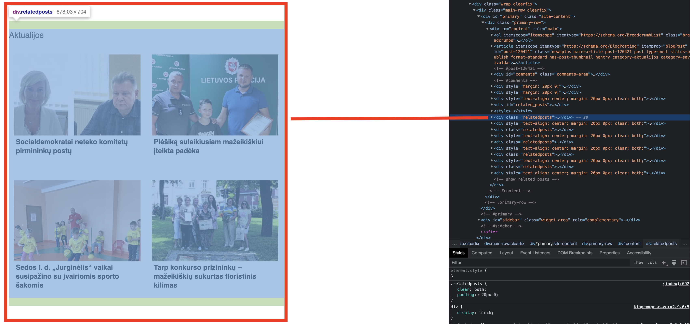
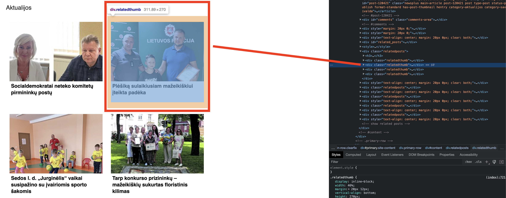
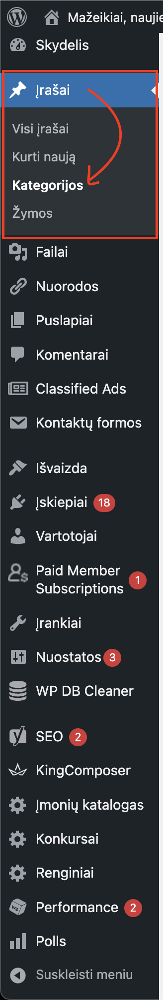
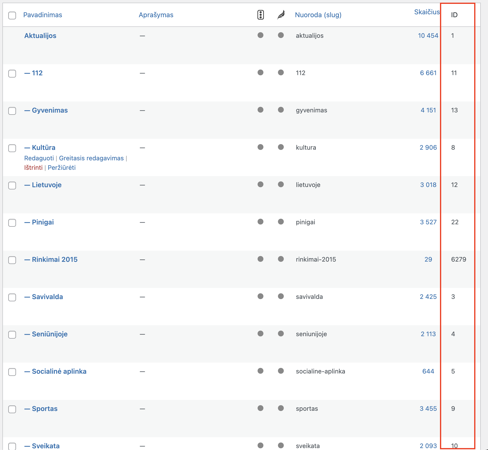
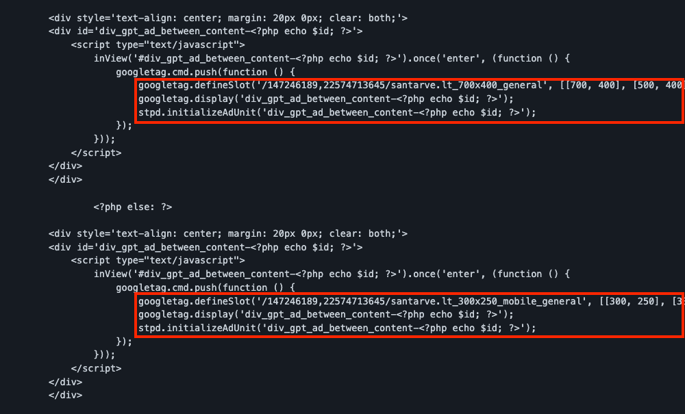

# Related articles insertion
Inserting related articles and banners between into WP post page.

# Summary
This documentation will guide you through steps on how to insert related posts into your website's article pages with banners between them.

# About our solution
## What is it?
The solution we created lets you insert related articles after every post automatically. The solution is pretty simple to add and doesn't require usage of plugins.

## Why do we need it?
From our experience, we've seen that pages with related articles generates more user interaction, which makes users spend more time on a website. It is also a great opportunity to capitalize from additional banners that can be inserted between related articles.

Also, our solution is light and doesn't load or use uneccessary data. 

# Implementation

## The code:

This whole block of code needs to be inserted in single.php file, which is located under wordpress theme directory. Single.php file is responsible for generating article pages. Since we want related posts to show at the bottom of the page, we generaly want to place this code there as well.

Keep in mind that ***EVERY*** case can be different, so don't blindly place the code at the bottom. If your single.php file already has an HTML structure, you might want to place this code inside already existing div tags.

***We strongly suggest to make a back up of single.php file before doing any changes***

```
<div id="related_posts"><h3> Related posts:</h3></div>

    <style>

        .relatedposts {
            clear: both;
            padding: 20px 0;
        }

        @media only screen and (max-width: 767px) {
            .relatedthumb {
                width: 47% !important;
                margin: 0 1% 25px 1%!important;
                height: 170px !important;
            }

            .relatedbackground {
                height: 110px !important;
            }

            .relatedtitle {
                overflow: hidden;
                display: -webkit-box;
                -webkit-line-clamp: 5;
                -webkit-box-orient: vertical;
                height: 95px !important;
                font-weight: bold;
                font-size: 13px !important;
                padding: 5px;
                line-height: 15px !important;
            }
        }

        .relatedthumb {
            display: inline-block;
            width: 46%;
            margin: 20px 12px;
            vertical-align: bottom;
            height: 270px;
        }

        .relatedtitle {
            height: 100px;
            font-weight: bold;
            font-size: 17px;
            padding: 5px;
            line-height: 22px;
        }

        .relatedposts > h4 > a, .relatedthumb a {
            color: #000000;
        }
    </style>


	<?php
	if (wp_is_mobile()) {
		$related_articles_limit = 4;
	} else {
		$related_articles_limit = 4;
	}

	function articles_from_category($id, $limit) {

		$args     = array(
			'cat'              => $id,
			'posts_per_page'   => $limit, // Number of related posts that will be displayed.
			'caller_get_posts' => 1,
			'orderby'          => 'DESC' // Sort posts by date
		);
		$my_query = new wp_query($args);
		if ($my_query->have_posts()) {

			echo "<div class=\"relatedposts\"><h3><a href='" . get_category_link($id) . "'>" . get_cat_name($id) . "</a></h3>";

			while ( $my_query->have_posts() ) {
				$my_query->the_post();
				?>
				<?php if (has_post_thumbnail()) { ?>
					<?php $image_url = wp_get_attachment_image_src(get_post_thumbnail_id($post->ID), 'medium'); ?>

                    <div class="relatedthumb">
                        <a href="<?php the_permalink() ?>" rel="bookmark" title="<?php the_title_attribute(); ?>">
                            <div class="relatedbackground" style="background: url('<?php echo $image_url[0]; ?>'); height: 200px; background-size: cover;"></div>
                            <div class="relatedtitle"><?php the_title(); ?></div>
                        </a>
                    </div>
				<?php } else { ?>
                    <div class="relatedthumb">
                        <a href="<?php the_permalink() ?>" rel="bookmark" title="<?php the_title_attribute(); ?>">
                            ID, 'Image', true) ?>" width="196" height="110"
                                 alt="<?php the_title_attribute(); ?>">
							<?php the_title(); ?></a>
                    </div>
				<?php } ?>
				<?php
			}
			echo '</div>'; ?>

            <div style='text-align: center; margin: 20px 0px; clear: both;'>

				<?php if (!wp_is_mobile()): ?>

                    <div style='text-align: center; margin: 20px 0px; clear: both;'>
                        <div id='div_gpt_ad_between_content-<?php echo $id; ?>'>
                            <script type="text/javascript">
                                inView('#div_gpt_ad_between_content-<?php echo $id; ?>').once('enter', (function () {
                                    googletag.cmd.push(function () {
                                        googletag.defineSlot('/147246189,22574713645/santarve.lt_700x400_general', [[700, 400], [500, 400], [336, 280], 'fluid'], 'div_gpt_ad_between_content-<?php echo $id; ?>').addService(googletag.pubads());
                                        googletag.display('div_gpt_ad_between_content-<?php echo $id; ?>');
                                        stpd.initializeAdUnit('div_gpt_ad_between_content-<?php echo $id; ?>');
                                    });
                                }));
                            </script>
                        </div>
                    </div>

				<?php else: ?>

                    <div style='text-align: center; margin: 20px 0px; clear: both;'>
                        <div id='div_gpt_ad_between_content-<?php echo $id; ?>'>
                            <script type="text/javascript">
                                inView('#div_gpt_ad_between_content-<?php echo $id; ?>').once('enter', (function () {
                                    googletag.cmd.push(function () {
                                        googletag.defineSlot('/147246189,22574713645/santarve.lt_300x250_mobile_general', [[300, 250], [336, 280]], 'div_gpt_ad_between_content-<?php echo $id; ?>').addService(googletag.pubads());
                                        googletag.display('div_gpt_ad_between_content-<?php echo $id; ?>');
                                        stpd.initializeAdUnit('div_gpt_ad_between_content-<?php echo $id; ?>');
                                    });
                                }));
                            </script>
                        </div>
                    </div>

				<?php endif; ?>
            </div>

			<?php
		}

		wp_reset_query();

	}

	?>

	<?php articles_from_category(1, $related_articles_limit); ?>
	<?php articles_from_category(11, $related_articles_limit); ?>
	<?php articles_from_category(13, $related_articles_limit); ?>
	<?php articles_from_category(8, $related_articles_limit); ?>
	<?php articles_from_category(12, $related_articles_limit); ?>


    <!-- show related posts -->
    
    
```

# Key points of the code

## The CSS part:

```
<style>

        .relatedposts {
            clear: both;
            padding: 20px 0;
        }

        @media only screen and (max-width: 767px) {
            .relatedthumb {
                width: 47% !important;
                margin: 0 1% 25px 1%!important;
                height: 170px !important;
            }

            .relatedbackground {
                height: 110px !important;
            }

            .relatedtitle {
                overflow: hidden;
                display: -webkit-box;
                -webkit-line-clamp: 5;
                -webkit-box-orient: vertical;
                height: 95px !important;
                font-weight: bold;
                font-size: 13px !important;
                padding: 5px;
                line-height: 15px !important;
            }
        }

        .relatedthumb {
            display: inline-block;
            width: 46%;
            margin: 20px 12px;
            vertical-align: bottom;
            height: 270px;
        }

        .relatedtitle {
            height: 100px;
            font-weight: bold;
            font-size: 17px;
            padding: 5px;
            line-height: 22px;
        }

        .relatedposts > h4 > a, .relatedthumb a {
            color: #000000;
        }
    </style>
```

1) The *relatedposts* class is responsible for one block style. One block, in this case, consists of 4 articles:




```
.relatedposts {
            clear: both;
            padding: 20px 0;
        }
```

2) The *relatedthumb* class is responsible for one item inside a block:



```
.relatedthumb {
            display: inline-block;
            width: 46%;
            margin: 20px 12px;
            vertical-align: bottom;
            height: 270px;
        }
```

3) The *relatedtitle* and *relatedbackground* classes are used for item photo and title below it:


```
.relatedbackground {
                height: 110px !important;
            }

            .relatedtitle {
                overflow: hidden;
                display: -webkit-box;
                -webkit-line-clamp: 5;
                -webkit-box-orient: vertical;
                height: 95px !important;
                font-weight: bold;
                font-size: 13px !important;
                padding: 5px;
                line-height: 15px !important;
            }
```

***Note:*** 

```
@media only screen and (max-width: 767px)
```

is responsible for showing different design for mobile devices.

The CSS should be changed if there's a need for it, since every website is individual.

## Article count per block

```
<?php
	if (wp_is_mobile()) {
		$related_articles_limit = 4;
	} else {
		$related_articles_limit = 4;
	}
```

By default we set that one block contains 4 articles. We can change that to as much as we want. 4 - 6 is the usual number. You can also set different number for either mobile or desktop device.

Once the number is set, at the end of the code you can see that we use this variable to then print out the articles:

```
	<?php articles_from_category(1, $related_articles_limit); ?>
	<?php articles_from_category(11, $related_articles_limit); ?>
	<?php articles_from_category(13, $related_articles_limit); ?>
	<?php articles_from_category(8, $related_articles_limit); ?>
	<?php articles_from_category(12, $related_articles_limit); ?>
```

Here, we can customise the number of articles shown in one block. 

``` <?php articles_from_category(11, $related_articles_limit); ?> ```

The number *11* is the ID of our article category, and $related_articles_limit in our example is set to 4. We could for example change it to any number we want. The code could look like this:

```
	<?php articles_from_category(1, $related_articles_limit); // 4 articles will in one block ?>  
	<?php articles_from_category(11, 6); // 6 articles will be in one block ?>
	<?php articles_from_category(13, 2); // 2 articles will be in one block ?>
	<?php articles_from_category(8, 4); // 4 articles will be in one block ?>
	<?php articles_from_category(12, 8); // 8 articles will be in one block ?>
```

## Category of articles

A really important thing to check is the article category ID, which can be found here, as previously mentioned:
```
	<?php articles_from_category(1, $related_articles_limit); // First block ?>
	<?php articles_from_category(11, $related_articles_limit); // Second block ?>
	<?php articles_from_category(13, $related_articles_limit); // Third block ?>
	<?php articles_from_category(8, $related_articles_limit); // Fourth block ?>
	<?php articles_from_category(12, $related_articles_limit); // Fifth block ?>
```

The numbers 1, 11, 13, 8, 12 are the category ID's. 

Finding the ID is simple, all you have to do is in wordpress admin panel, go to posts -> categories:



There you'll find this table:



Find the corresponding ID's of the article categories you want to be shown in related posts section and change them with the ones given in the example.

## Banners between related posts

This part here:

```
<div style='text-align: center; margin: 20px 0px; clear: both;'>

				<?php if (!wp_is_mobile()): ?>

                    <div style='text-align: center; margin: 20px 0px; clear: both;'>
                        <div id='div_gpt_ad_between_content-<?php echo $id; ?>'>
                            <script type="text/javascript">
                                inView('#div_gpt_ad_between_content-<?php echo $id; ?>').once('enter', (function () {
                                    googletag.cmd.push(function () {
                                        googletag.defineSlot('/147246189,22574713645/santarve.lt_700x400_general', [[700, 400], [500, 400], [336, 280], 'fluid'], 'div_gpt_ad_between_content-<?php echo $id; ?>').addService(googletag.pubads());
                                        googletag.display('div_gpt_ad_between_content-<?php echo $id; ?>');
                                        stpd.initializeAdUnit('div_gpt_ad_between_content-<?php echo $id; ?>');
                                    });
                                }));
                            </script>
                        </div>
                    </div>

				<?php else: ?>

                    <div style='text-align: center; margin: 20px 0px; clear: both;'>
                        <div id='div_gpt_ad_between_content-<?php echo $id; ?>'>
                            <script type="text/javascript">
                                inView('#div_gpt_ad_between_content-<?php echo $id; ?>').once('enter', (function () {
                                    googletag.cmd.push(function () {
                                        googletag.defineSlot('/147246189,22574713645/santarve.lt_300x250_mobile_general', [[300, 250], [336, 280]], 'div_gpt_ad_between_content-<?php echo $id; ?>').addService(googletag.pubads());
                                        googletag.display('div_gpt_ad_between_content-<?php echo $id; ?>');
                                        stpd.initializeAdUnit('div_gpt_ad_between_content-<?php echo $id; ?>');
                                    });
                                }));
                            </script>
                        </div>
                    </div>

				<?php endif; ?>
            </div>
```

is responsible for banner insertion between related post blocks. It adds either a mobile or desktop banner depending on the device. It's a standart SaaS tag, only difference is we're using "inView" library, which is responsible for the banner to be lazy-loaded. For this to work you'll need to add this code in your websites header:

```
<!-- Inscreen lib -->
<script type="text/javascript" src="https://cdn.jsdelivr.net/npm/in-view@0.6.1/dist/in-view.min.js"></script>
<script>inView.offset(-800);</script>
```

### Note:

Keep in mind that this part of banner code here:



```
googletag.defineSlot('/147246189,22574713645/santarve.lt_700x400_general', [[700, 400], [500, 400], [336, 280], 'fluid'], 'div_gpt_ad_between_content-<?php echo $id; ?>').addService(googletag.pubads());
```

needs to be changed accordingly to your banners. The defineSlot part is an example and must be changed to your SaaS tag defineSlot ID.
